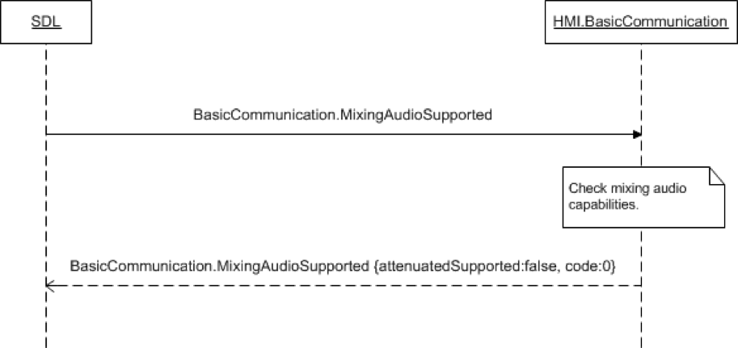

## 5.3 MixingAudioSupported

Purpose: inform SDL whether the vehicle audio system has the ability to speak the TTS prompts or listen to an recognize VR commands while playing audio.

_Note_

SDL is able to get information about the audio mixing capabilities from [SmartDeviceLink.ini](../Guide_index/13.3Configuration%20file.md#133-configuration-file). If the request is ignored and there is no record for audio mixing capabilities in smartDeviceLink.ini, SDL will assume mixing audio is not supported.


### Behavior

HMI must

Check mixing audio capabilities and provided an accurate response.


### Request

#### Parameters

|Name|Type|Mandatory|Additional|
|:---|:---|:--------|:---------|
|||||
### Response

#### Parameters

|Name|Type|Mandatory|Additional|
|:---|:---|:--------|:---------|
|attenuatedSupported|Boolean|true||

### Request Example

```json
{
  "id" : 27,
  "jsonrpc" : "2.0",
  "method" : "BasicCommunication.MixingAudioSupported"
}
```

### Response Example

```json
{
  "id" : 27,
  "jsonrpc" : "2.0",
  "result" :
  {
    "attenuatedSupported" : true,
    "code" : 0,
    "method" : "BasicCommunication. MixingAudioSupported"
  }
}
```

### Error Example

```json
{
  "id" : 27,
  "jsonrpc" : "2.0",
  "error" :
  {
    "code" : 22,
    "message" : "An unknown error occurred",
    "data" :
    {
      "method" : "BasicCommunication.MixingAudioSupported"
    }
  }
}
```

### Sequence Diagrams

MixingAudioSupported Messaging


