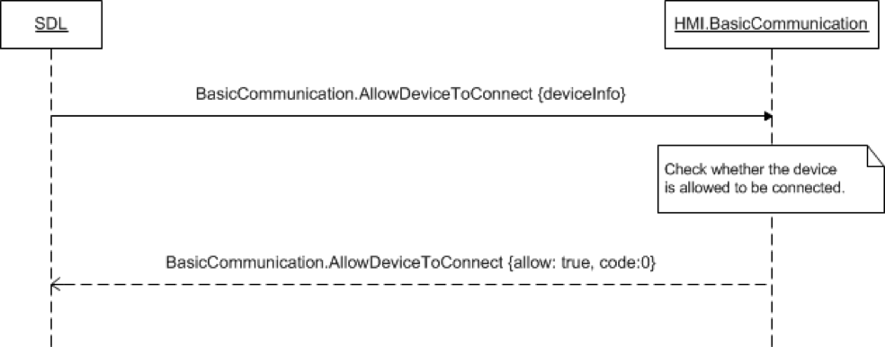

## 5.4 AllowDeviceToConnect
  * Type: Function
  * Sender: SDL
  * Purpose: Permit device to connect to head unit

### Behavior

HMI must

Check whether the device is allowed to connect to the head unit and response appropriately


HMI may

  1. Request the user's permission via VR, UI pop-up, etc.
  2. Implement a use case in which a user's device is not allowed to connect


### Request

#### Parameters

|Name|Type|Mandatory|Additional|
|:---|:---|:--------|:---------|
|device|[Common.DeviceInfo](../Guide_index/13.3Structs.md/#deviceinfo)|true||

### Response

#### Parameters

|Name|Type|Mandatory|Additional|
|:---|:---|:--------|:---------|
|allow|Boolean|true||

### Example Request
```json
{
  "id" : 87,
  "jsonrpc" : "2.0",
  "method" : "BasicCommunication.AllowDeviceToConnect",
  "params" :
  [
    "deviceInfo" : {
        "name" : "Mary`s Phone",
        "id" : 8
    }
  ]
}
```

### Example Response

```json
{
  "id" : 87,
  "jsonrpc" : "2.0",
  "result" :
  {
   "allow" : true,
    "code" : 0,
    "method" : "BasicCommunication.AllowDeviceToConnect"
  }
}
```

### Error Message
```json
{
  "id" : 87,
  "jsonrpc" : "2.0",
  "error" :
  {
    "code" : 22,
    "message" : "An unknown error occurred",
    "data" :
    {
      "method" : "BasicCommunication.AllowDeviceToConnect"
    }
  }
}
```

### Sequence Diagrams

AllowDeviceToConnect Messaging

