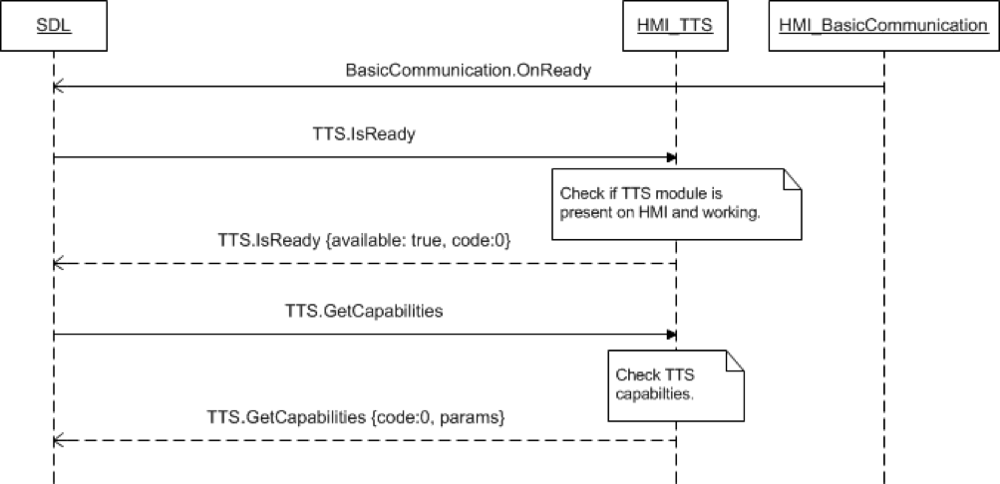

## 9.2 GetCapabilities

Type
: Function

Sender
: SDL

Purpose
: Inform SDL of the TTS capabilities of the vehicle.

### Request

#### Parameters

|Name|Type|Mandatory|Additional|
|:---|:---|:--------|:---------|

### Response

#### Parameters

|Name|Type|Mandatory|Additional|
|:---|:---|:--------|:---------|
|speechCapabilities|[Common.SpeechCapabilities](../Guide_index/13.2Enumerations.md/#speechcapabilities)|true|array: true<br>minsize: 1<br>maxsize: 5|
|prerecordedSpeechCapabilities|[Common.PrerecordedSpeech](../Guide_index/13.2Enumerations.md/#prerecordedspeech)|true|array: true<br>minsize: 1<br>maxsize: 5|

### Sequence Diagrams

GetCapabilities



### Example Request

```json
{
  "id" : 13,
  "jsonrpc" : "2.0",
  "method" : "TTS.GetCapabilities"
}
```
### Example Response

```json
{
  "id" : 13,
  "jsonrpc" : "2.0",
  "result" :
  {
    "capabilities" : [TEXT],
    "prerecordedSpeechCapabilities" : [HELP_JINGLE, INITIAL_JINGLE, LISTEN_JINGLE, POSITIVE_JINGLE, NEGATIVE_JINGLE],
    "code" : 0,
    "method" : "TTS.GetCapabilities"
  }
}
```

### Example Error

```json
{
  "id" : 28,
  "jsonrpc" : "2.0",
  "error" :
  {
    "code" : 11,
    "message" : "The data sent is invalid",
    "data" :
    {
      "method" : "TTS.GetCapabilities"
    }
  }
}
``
